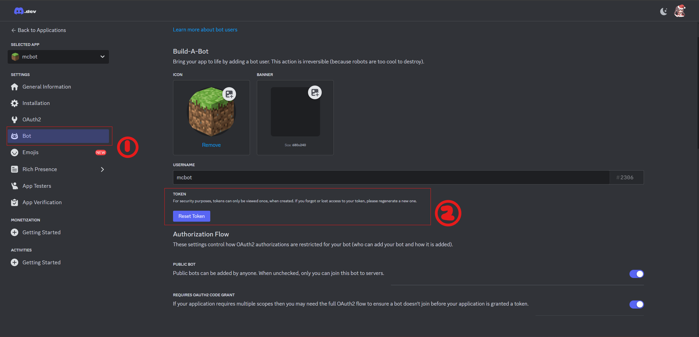
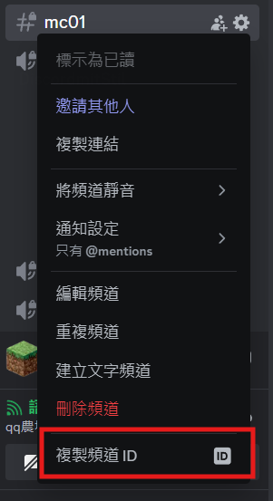

# DiscordPipe

DiscordPipe is a Minecraft Spigot server plugin that integrates Minecraft server messages, player chats, and various events with a Discord channel. It allows Minecraft players to use Discord emojis in their messages and pipes server events such as player deaths and achievements to specific Discord text channel.

## Features

- Easy to use. Support original client.
- Pipe Minecraft player chat messages to a Discord channel.
- Allow Minecraft players to use Discord emojis in their messages.
- Broadcast server events (like player deaths and achievements) to a Discord channel.
- Handle and format various types of messages and attachments from Discord.

<center>


</center>

## Requirements

### Server side

- Java 22 or higher (compatibility for older versions haven't been tested yet.)
- Maven
- Discord Bot

### Client side
 - Any client will do, including the original one.

## Installation

1. **Clone the Repository:**

```sh
git clone <repository_url>
cd <repository_directory>
```

2. Build the Plugin:

Build the plugin using Maven:  

```sh
mvn package
```

This will generate a JAR file in the `target` directory.  

3. Deploy the Plugin:

Copy the generated JAR file to your Minecraft server's `plugins` directory:  

```sh
cp target/DiscordLogger-{version}.jar /path/to/your/minecraft/server/plugins/
```

4. Configure the Plugin:

Start your Minecraft server once, and two new field will be created in your `server.properties`. Add your Discord bot token and channel ID to your `server.properties` file:

```properties
discord.bot.token=YOUR_DISCORD_BOT_TOKEN
discord.channel.id=DISCORD_TEXT_CHANNEL_ID
```

If you have no idea what they are, you can create your own Discord bot from [Discord developer portal](https://discord.com/developers/applications).  

  

And you can got the ID of specific channel from your discord client.  

  

If you still have trouble finding them, please refer to other tutorials. They are not the key point of this plugin.  

5. Start the Server:

Restart your Minecraft server. The plugin should now be active.

## Usage

### Chat Integration

 - Minecraft players can use `:emoji_name:` syntax to include Discord emojis in their chat messages.
 - Messages from Minecraft will be sent to the specified Discord channel.

### Server Events

 - Player deaths and achievements will be broadcasted to the Discord channel.

### Discord Integration

 - Messages sent in the specified Discord channel will be broadcasted to the Minecraft server.
 - Attachments such as images, videos, and audio files will be handled and announced appropriately.

## Development

### Project Structure

 - `src/main/java/com/yourname/discordlogger/DiscordLogger.java`: Main plugin class.
 - `src/main/java/com/yourname/discordlogger/PlayerChatListener.java`: Handles player chat messages.
 - `src/main/java/com/yourname/discordlogger/ServerEventListener.java`: Handles server events like player deaths and achievements.
 - `src/main/resources/plugin.yml`: Plugin configuration.

### Building the Project

To build the project, run the following command:

```sh
mvn clean package
```

### Contributing

 1. Fork the repository.
 2. Create a new branch for your feature or bugfix.
 3. Make your changes.
 4. Submit a pull request.

## License
This project is licensed under the MIT License.

## Acknowledgements
 - [JDA](https://github.com/discord-jda/JDA) for providing the Discord API.
 - The Spigot community for their extensive documentation and support.